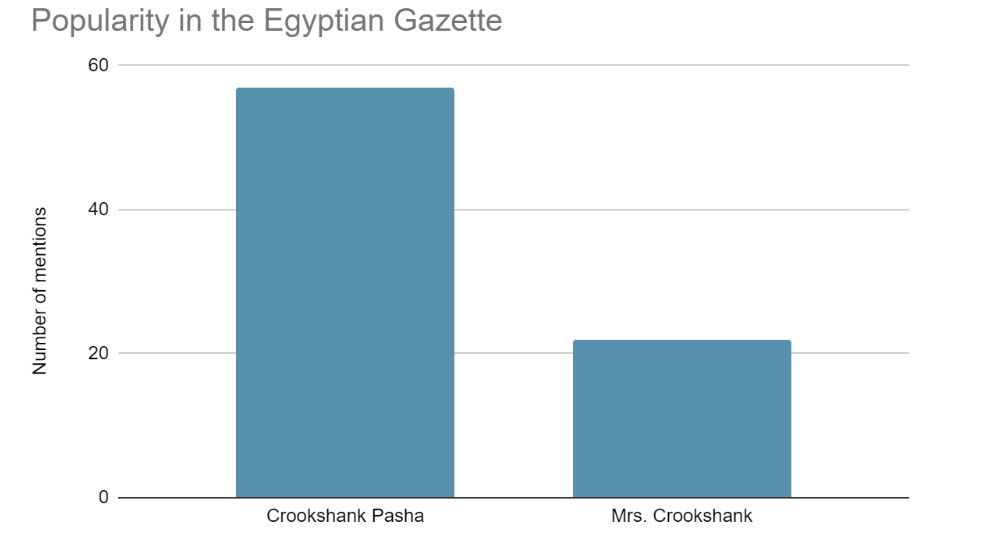

While reading the Egyptian Gazette, I came across many mentions of seemingly trivial details about members of the upper class, including a mention of Crookshank Pasha’s travel dates. Intrigued by the interest the public had in the movements of their leaders, I began looking into how many times specific leaders were mentioned when I noticed a pattern: the importance of their wives. Despite having no significant job themselves, the wives of powerful men were mentioned continuously in the Gazette.

As in the case of the Crookshanks, Mrs. Crookshank was mentioned almost half as many times as her husband, despite not being the one influencing public policy. However, while she may not have held office, Mrs. Crookshank and many other wives like her held their own unique influence over the public in an emerging role: the celebrity. [In the diary of diplomat Thomas Skelton Harrison,](https://babel.hathitrust.org/cgi/pt?id=uc2.ark:/13960/t74t6hh6b&view=1up&seq=13) Mrs. Crookshank is repeatedly mentioned and described in personal detail, whereas her husband is only listed for his duties. This suggests that It is well known that [women had great influence in the home](https://www.bl.uk/romantics-and-victorians/articles/gender-roles-in-the-19th-century) during this period, but they also were able to influence society as a whole in the social sphere. As suggested by women becoming aware of their autonomy and worth, which can be seen in Sonali Pustam’s [blog post,](https://dig-eg-gaz.github.io/post/18-blog-pustam/) gender roles began to change in the 1900s.  This pattern is reflected in the mentioning of wives of politicians as public figures in their own right. [Mrs. Crookshank’s outfit](https://raw.githack.com/dig-eg-gaz/content/master/1905-11-18.xml) at a wedding is even reported in the Gazette with no mention of her husband, a true sign of her individual status. As seen in another [blog post by Sonali Pustam,](https://dig-eg-gaz.github.io/post/18-analysis-pustam/) women’s fashion was being reported more in the 1900s, a sign of the continuing influence that upper class wives had on the general public. 