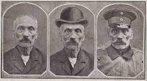

In the 1906-10-30 issue of the Egyptian Gazette, I came across a telegram cable about “The Koepenick Robbery”. This telegram discussed how a man named Voigt appeared in court and the entire courtroom burst into laughter. This struck me as odd, so I looked for further instances where the Koepenick robbery or Mr. Voigt were mentioned in the Egyptian Gazette. Employing a simple word search through my content repository I found 7 examples where either Mr. Voigt or the robbery were mentioned. Using these newspaper entries and outside sources, I learned that, in 1906, a man named Wilhelm Voigt pretended to be a Prussian military officer and used his "position" to arrest the mayor of Koepenick and steal 4,000 marcs from their municipal treasury. The story caught the world by storm and despite his apparent violation of the law, media outlets portrayed him as the protagonist of the story. While many law enforcement officers contended Voigt was a terrible criminal who deserved to be imprisoned for his actions, the public admired his ability to outwit the government and military figures. This increasing admiration led to the German Emporer of the time, Wilhelm II, pardoning Voigt of his transgressions. While this is an entertaining and humorous story of civilian cunningness, it also reveals a greater truth about the influence of public perception and the power of the media in international affairs. Before his daring escapade, Voigt was a low-class shoemaker. Therefore, much of the European population related to Voigt’s humble beginnings, likely contributing to their later praise of his ability to deceive privileged, upper-class political powers. Specifically, Voigt undermined German authority. For this reason, I have included a link to Daniel Arenas’s Blog Post, [_Attitudes towards Germany: Random, Situational, or Seasonal?_](https://dig-eg-gaz.github.io/post/18-analysis-arenas/), in which Arenas seeks to uncover the impact of media propaganda through articles supportive and critical of Germany during World War II (the time in which the Koepenick robbery also took place).

It is also important to note that even though Voigt’s actions did not directly impact the people in Alexandria, he was still a notable and recurring entry in their local paper. The story’s presence in the Egyptian Gazette reveals its reader’s interests and attitudes toward international incidents. For this reason, I have attached a link to Jacob Stefonek’s post on [_Fleet Tracking_](https://dig-eg-gaz.github.io/post/16-analysis-stefonek/), which also discusses how the Egyptian Gazzete covers multinational incidents, specifically concerning the location of Russian and Japanese fleets in 1905. Like Voigt’s case, this information was not relevant to Alexandrian residents but still appeared in their papers
 
## Sources:
- [This Day In History - October 17 1906](https://www.history.com/this-day-in-history/a-shoemaker-leads-german-soldiers-in-a-robbery)  
- [_Journalistische Vermittlung und ihre Aneignung_ - Abstract](https://journals.univie.ac.at/index.php/oezg/article/view/5087)
- [_Anti-Freud_: Karl Kraus's Criticism of Psycho-analysis and Psychiatry By Thomas Szasz, Karl Kraus · 1990 (Page 122)](https://www.google.com/books/edition/Anti_Freud/qXApVDVKWZUC?hl=en&gbpv=0)