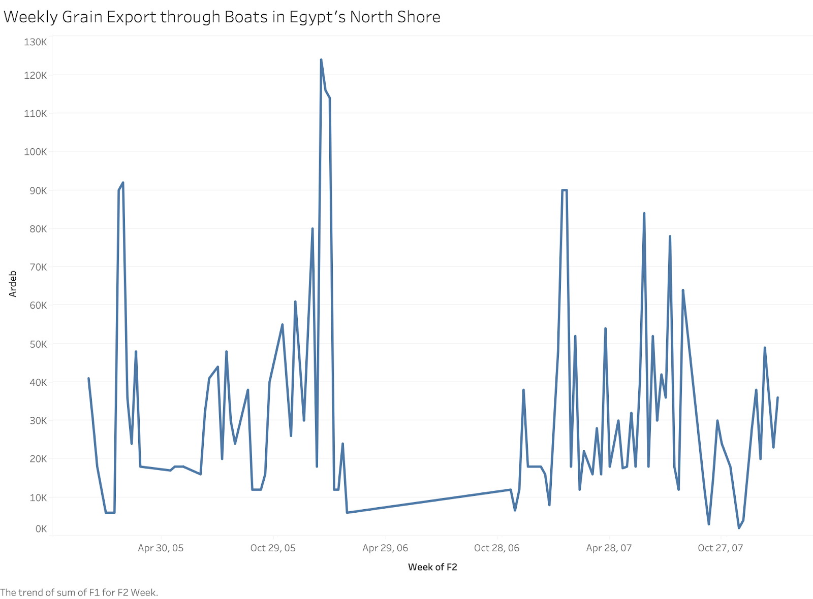

X-Query: `//head[contains(.,'Cereals in Boat at Sahel')]/following-sibling::row[1]/cell[3]/measure`

For my individual research project, I decided to look at the weekly export of wheat from Sahel. Sahel is another term used to describe the north coast of Egypt, where the majority of their exports flow through into the Mediterranean. I tracked the exports from the beginning of 1905 to the beginning of 1908, and found some commonalities between the years. The peak of exports seems to be from January to mid-March. This is because the Nile flooded in mid-September, spreading sediment and other nutrients into the farmland that allowed the farmers to grow crops. Wheat tends to take 120-140 days to fully mature, so the wheat would be ready for harvest in the January-February time frame. However, the British started building dams and water resources in 1902 to try and make the farming season year round by providing a consistent source of water. However, the initial Aswan dam was not capable of storing or providing enough water to provide any sustainable amount of farming water so the yearly flood cycle was still the main source of gaining nutrients for farming and providing water for irrigation. 

In the graph the exports in early 1906 are unrivaled, with a weekly peak at over 120k ardebs. However, the weeks prior to that week are underwhelming compared to other years, so I believe that something limited exports during those times and that caused the week after whatever event to have hyperinflated export numbers. Compared to 1906, 1907 has much lower export numbers. This can be tied to the Denshawai Incident, where a flare up of violence between Egyptian villagers and British soldiers led to more of the Egyptian population turning to nationalism and seeing cooperation with the British as not possible. This translates into farmers being less willing to export large sums of wheat, and instead keeping and selling it within the country or to export it in other ways that do not go to European countries, therefore not going by boat through the North of Egypt. The middle part of 1906, where a straight line is present, is a portion where either no newspapers have been uploaded or they do not have export charts with them. I cannot find any outside resources to help give any insight into what the export numbers may have looked like. 

Culturally and historically wheat has been extremely important to the Egyptian way of life. The Ancient Egyptians would farm and sustain themselves off wheat, and mastered farming it. They understood the Nile’s flooding cycle, irrigation, and storage amongst all the other things. This major emphasis however has made Egypt the eye of many large empires. Originally, the Romans took over Egypt and used it to feed their Empire. The Romans saw Egypt as so important that they allowed them to continue having a Pharaoh to try and maintain the peace in order to milk grain out to feed Rome. This is no different than Muhammad Ali Pasha, who modernized Egypt to become a massive cotton producer. However, Egypt could not produce cotton 24/7, so they also grew wheat in the cotton off-season, and lived and sold this wheat. 

Overall, through my research and the analysis of my quantitative data, I gained a stronger understanding of not only the export and farming patterns of Egypt in the early 20th century, but also the cultural effect of the production of wheat throughout Egyptian history into the modern times. The introduction of water reservoirs and dams, such as the creation of development of the Suez Canal and Aswan Dam amongst other water conservation and distribution sources, has had a massive effect on the growing capabilities of Egypt, as well as the amount of work farmers have to do. The average farmer in the 1900’s had to work year round, compared to pre-colonization workers that only worked one cycle as they had work for sustainment opposed to profit. The introduction of cotton farming as a profit driven business also led to workers having to work more, and work harder. This led to Egypt decreasing their wheat production in favor of growing and selling raw cotton to processing mills throughout Europe and using the profit to prop up their economy.

## Outside Source
Foaden. “Text-Book of Egyptian Agriculture, Ed. by G. P. Foaden ... and F. Fletcher ... v. 1.” HathiTrust, https://babel.hathitrust.org/cgi/pt?id=njp.32101048820458. 

